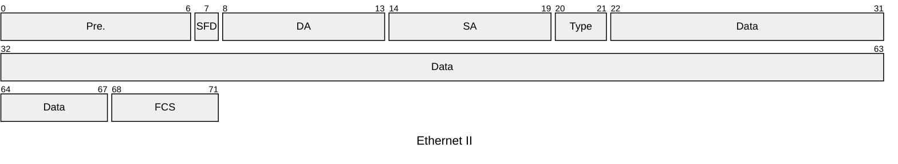
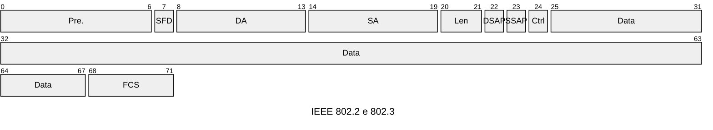
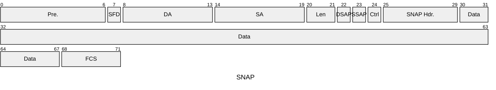

# Ethernet e lo standard IEEE 802.3

>- primi anni ’70 del secolo scorso: consorzio DIX=Digital + Intel + Xerox
>- 1980 Ethernet I
>- 1982 Ethernet II
>- 1989 IEEE 802.3 diventa ISO 8802.3
>- 1990 $\to$ trasmissioni su filo

- mezzi trasmissivi
   - cavi in rame twisted pair
   - fibre 
- trasmissione
   - punto-punto bidirezionale tra due stazioni
- velocità
   -  10Mb/s a attuali

### livello MAC (sostanzialmente invariato nel tempo)
>- preambolo: 56 bit
>- SFD (Start Frame Delimiter): indica l’inizio del pacchetto, 8 bit
>- destination e source MAC address: 48+48 bit
>- length: numero di byte del campo data, 16 bit
>- data (payload): contiene una LLC pdu
>- pad: eventuale riempimento; data+pad = 46-1500 byte
>- FCS (Frame Check Sequence): contiene il valore di crc (codice a ridondanza ciclica) calcolato, 32 bit
>>non c’è un delimitatore di fine pacchetto

inter-frame space (IFS) o inter-packet gap (IPG): tempo minimo tra due pachetti consecutivi
- $0.96 \mu s$

lung. minima e massima del pacchetto esclusi preambolo e sfd
- 64 byte (512 bit) - 1518 byte
- se i dati non sono sufficienti a raggiungere la dimensione minima, allora si aggiunge pad (riempimento)

### funzioni svolte dal livello MAC
- trasmissione dei pacchetti
- ricezione dei pacchetti
- generazione di FCS in trasmissione: contiene un codice a ridondanza ciclica (crc) per il controllo degli errori
- controllo di FCS in ricezione
- spaziatura di pacchetti: il MAC garantisce un tempo minimo tra due pacchetti; IPG = 96 bit-time
- verifica di lunghezza minima pacchetto
- generazione e rimozione del preambolo

## Reti Ethernet
in passato la trasmissione non era punto-punto bidirezionale, ma il mezzo trasmissivo (bus) era condiviso tra varie stazioni ed usato a turno

> il mezzo trasmissivo condiviso era chiamato dominio di collisione – terminologia ancora oggi utilizzata – perché i pacchetti spediti da varie stazioni potevano collidere e, in caso, dovevano essere ritrasmessi

il mezzo trasmissivo condiviso era spesso realizzato con un apparato, chiamato repeater
- in un dominio di collisione un pacchetto spedito da un computer può essere ascoltato da ogni altro computer

### ripetitore – repeater – hub
Il ripetitore (repeater, hub) è situato al livello fisico
- varie porte
- ripete il segnale ricevuto da una porta a tutte le altre porte

### Ethernet – cavi in rame
- cavo in rame
   - twisted pair
   - contiene più coppie di fili
- cavo di massimo 100 m
- uso di coppie separate per trasmissione e ricezione
- connettore RJ-45, ampiamente usato

## Ethernet

|Pre.|SFD|DA|SA|Type|Data|FCS|
|:-:|:-:|:-:|:-:|:-:|:-:|:-:|

## IEEE 802.2 e 802.3

|Pre.|SFD|DA|SA|Len|DSAP|SSAP|Ctrl|Data|FCS|
|:-:|:-:|:-:|:-:|:-:|:-:|:-:|:-:|:-:|:-:|

## SANP (Sub Net Access Point)

|Pre.|SFD|DA|SA|Len|DSAP|SSAP|SNAP Hdr.|Data|FCS|
|:-:|:-:|:-:|:-:|:-:|:-:|:-:|:-:|:-:|:-:|

>- standard per il mercato automotive
>- power over Ethernet

