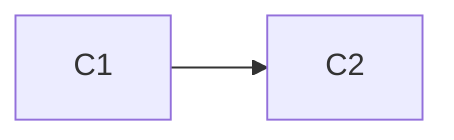
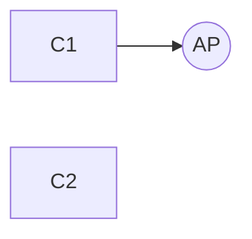
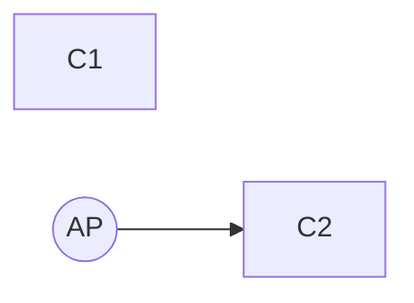
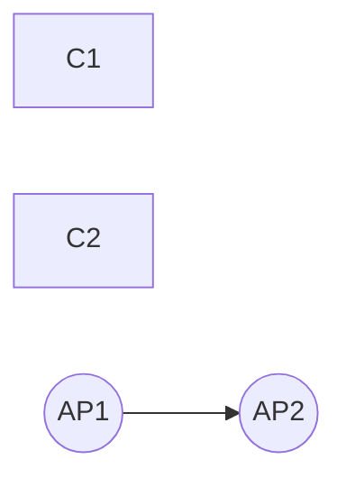

# Le reti wifi e lo standard IEEE 802.11
### motivazioni
>- edifici o locali nei quali non è possibile o economico realizzare un cablaggio
>- uffici nei quali gli impiegati sono presenti occasionalmente
>- aree pubbliche con utenti occasionali
>   - aeroporti, stazioni, sale congressi, alberghi, caffè
>- praticità di utilizzo
### problemi
>- mezzo trasmissivo poco affidabile
>- consumo energetico
>   - se è comunque necessario collegarsi con l’alimentazione, allora la praticità è ridotta
>- area di copertura limitata
>- salute
>- aspetti legali sull’uso delle frequenze
>- sicurezza

### Storia
>- nel 1990 il comitato IEEE 802 forma il working group IEEE 802.11, dedicato alle wireless LAN
>- il primo standard 802.11 ad affermarsi è stato 802.11b
>- nel 1999 si forma il consorzio Wireless Ethernet Compatibility Alliance, successivamente denominato Wi-Fi (Wireless Fidelity) Alliance, per la certificazione dei prodotti IEEE 802.11

## EEE 802.11 – architetture

- reti ***ad hoc***
   - le stazioni comunicano direttamente l'una con l'altra
   - pochi calcolatori in rete
- reti strutturate
   - le stazioni comunicano l'una con l'altra solo mediante punti di accesso (Access Point o AP)
   - scalabile
   - un AP ha il MAC IEEE 802.11 e si comporta come un bridge
   - ciascun AP controlla un BSS (Basic Service Set)
   - la parte wireless estende la parte wired
   - ogni BSS (Basic Service Set) ha un IDentifier (BSSID): ad es. l’indirizzo MAC della scheda wireless dell’AP corrispondente
   - DS (Distribution System): rete wired di backbone
   - è previsto anche il caso in cui gli AP (tutti o alcuni) dialoghino wireless e non tramite l’infrastruttura wired

## algoritmi per il MAC
- accesso distribuito al mezzo trasmissivo,
realizzato nel DCF – Distributed Coordination
Function
- accesso centralizzato al mezzo trasmissivo
gestito da un gestore centralizzato, realizzato
nel PCF – Point Coordination Function

## campi del pacchetto MAC
- frame control: indica il tipo di pacchetto (di
controllo o contenente dati) e fornisce anche le
seguenti informazioni
   - from e to DS
   - informazioni per la frammentazione
   - informazioni sulla riservatezza
- duration: indica il tempo necessario per la trasmissione
- indirizzi: fino a 4 indirizzi MAC
- sequence control: contiene informazioni utili per la frammentazione/riassemblaggio
- body: contiene una LLC-pdu o informazioni di controllo del MAC
- FCS: 32 bit di crc (codice a ridondanza ciclica)

## indirizzamento
- analogamente alle normali schede di rete, ogni scheda wireless è dotata di un indirizzo MAC
- il pacchetto viene raccolto da una scheda wireless se è diretto al suo indirizzo MAC
   - due macchine che si scambiano pacchetti wireless devono conoscere i rispettivi indirizzi MAC
- nel pacchetto di livello MAC ci sono ben 4 indirizzi
- più due bit:
   - chiamati ToDS e FromDS
   - ToDS vale 1 quando il pacchetto è spedito all’AP per essere smistato sul DS
   - FromDS vale 1 quando il pacchetto è stato ricevuto dal DS

|ToDS|FromDS|Address1|Address2|Address3|Address4|
|:-:|:-:|:-:|:-:|:-:|:-:|
|0|0|DA|SA|BSSID|_|
|0|1|DA|BSSID|SA|_|
|1|0|BSSID|SA|DA|_|
|1|1|RA|TA|DA|SA|

> - RA=recipient address (scheda ricevente)
> - TA=transmitter address (scheda trasmittente)
> - DA=destination address (destinatario finale)
> - SA=sender address (sorgente del pacchetto)

>- Address 1 è sempre l’indirizzo MAC della scheda wireless cui è destinato il pacchetto
>- Address 2 è sempre l’indirizzo MAC della scheda wireless che trasmette il pacchetto
>- address 3: se FromDS=1 contiene SA e se ToDS=1 contiene DA
>- address 4 è usato solo nel caso di comunicazione wireless nel distribution system

## Esempi di indirizzamento
### Trasmissione diretta tra due stazioni

|ToDS|FromDS|Address1|Address2|Address3|Address4|
|:-:|:-:|:-:|:-:|:-:|:-:|
|0|0|DA=C2|SA=C1|BSSID|_|
|0|1|DA|BSSID|SA|_|
|1|0|BSSID|SA|DA|_|
|1|1|RA|TA|DA|SA|
### Trasmissione da una stazione all’AP

|ToDS|FromDS|Address1|Address2|Address3|Address4|
|:-:|:-:|:-:|:-:|:-:|:-:|
|0|0|DA|SA|BSSID|_|
|0|1|DA|BSSID|SA|_|
|1|0|BSSID=AP|SA=C1|DA=C2|_|
|1|1|RA|TA|DA|SA|

### Trasmissione dall’AP ad una stazione

|ToDS|FromDS|Address1|Address2|Address3|Address4|
|:-:|:-:|:-:|:-:|:-:|:-:|
|0|0|DA|SA|BSSID|_|
|0|1|DA=AP|BSSID=AP|SA=C1|_|
|1|0|BSSID|SA|DA|_|
|1|1|RA|TA|DA|SA|

### Trasmissione dall’AP a un AP

|ToDS|FromDS|Address1|Address2|Address3|Address4|
|:-:|:-:|:-:|:-:|:-:|:-:|
|0|0|DA|SA|BSSID|_|
|0|1|DA|BSSID|SA|_|
|1|0|BSSID|SA|DA|_|
|1|1|RA=AP2|TA=AP1|DA=C2|SA=C1|

# DCF – Distributed Coordination Function
### requisiti del DCF MAC
- evitare interferenze tra trasmissioni simultanee (collisioni)
- nessun controllo centralizzato
- nessun clock
   - trasmissioni completamente asincrone 

### DCF utilizza l’algoritmo csma/ca

- carrier sense multiple access / collision avoidance
   - se una stazione ha un pacchetto da spedire verifica se il mezzo trasmissivo è disponibile
   - altrimenti attende che la trasmissione corrente sia stata completata
- è comunque possibile che due stazioni provino a trasmettere contemporaneamente
- collision avoidance

### DCF e inter-packet gap
- DCF sfrutta gli intervalli tra pacchetti consecutivi come strumento per gestire delle priorità
- due tipi principali di inter-packet gap (Inter-Frame Space, IFS)
   - DIFS: DCF Inter-Frame Space
   - SIFS: Short Inter-Frame Space (SIFS < DIFS)
- ci sono altri tipi di IFS

# DCF senza RTS/CTS
### per cercare di evitare collisioni
- quando una stazione vuole trasmettere ma il canale è occupato sceglie un numero random (detto di backoff) nell’intervallo [0, cw] ed inizializza un timer
- quando una stazione rileva una collisione duplica cw
- se un pacchetto è inviato con successo si pone $cw=cw_{min}$
- valori ragionevoli per $cw_{min}$ e $cw_{max}$ sono 7/../31 e 255/../1023

in ogni pacchetto spedito (diverso da un ack) è specificata la durata (campo duration) della trasmissione
- la durata viene memorizzata, da ogni stazione in ascolto, nel proprio NAV (Network Allocation Vector)
- il NAV viene utilizzato per sincronizzare le stazioni
   -  ogni stazione decrementa il suo NAV con il passare del tempo
   -  una stazione può trasmettere solo quando il proprio NAV è a zero

- i pacchetti sono riscontrati per mezzo di acknowledgement (ack)
   - la stazione destinataria, se riceve il pacchetto correttamente, invia sempre un riscontro (ack) al mittente
- nella spedizione di un acknowledgement si attende SIFS, più breve di DIFS
- nel NAV sono compresi il tempo dell’ack e quello del SIFS

## carrier sense
>il MAC IEEE 802.11 usa due strumenti per fare verificare la disponibilità del canale (per fare carrier sense)
>- fisico: informazione di canale libero dal livello fisico
>- logico: il NAV

>il canale è ritenuto libero quando entrambe le seguenti condizioni sono vere:
>- il livello fisico segnala canale libero
>- il NAV è arrivato a zero

## ack e collisioni
>quando una stazione inizia a trasmettere un pacchetto non si interrompe fino alla fine
>- la trasmissione del pacchetto deve essere sempre seguita da un acknowledgement (ack)
>- un pacchetto che ha avuto una collisione deve essere ritrasmesso
>- collisione = pacchetto che non ottiene ack

# DCF con RTS/CTS
### Problemi
- se il pacchetto su cui si verifica una collisione è molto grande si perde molto tempo prima che la collisione sia identificata
- nelle reti wireless è possibile che tra le stazioni ci sia visibilità *parziale*
- per tentare di risolvere questi problemi, il protocollo viene complicato ulteriormente

> il problema della stazione nascosta

meccanismo di prenotazione del canale
- quando una stazione vuole trasmettere spedisce un breve frame al destinatario, chiedendo l’autorizzazione alla trasmissione
- se il destinatario è disponibile emette un breve frame di conferma
- alle stazioni vicine è richiesto di non interferire per l’intera durata della trasmissione che sta per avvenire

- la duration viene memorizzata da ogni stazione in ascolto nel suo NAV (Network Allocation Vector)
- il NAV viene utilizzato per sincronizzare le stazioni
- le uniche collisioni possibili sono dovute all’invio simultaneo dell’RTS da parte di due stazioni

>percezione della collisione
>- la collisione viene rilevata quando la stazione trasmittente non riceve il CTS del destinatario

### uso di RTS/CTS nella pratica
- nelle stazioni è definita una soglia s che stabilisce per quali pacchetti utilizzare RTS/CTS
- molto spesso s ha il valore della dimensione massima di un pacchetto (1.500 byte)

# altri aspetti del MAC
### handshaking
- l’insieme delle stazioni di un BSS cambia continuamente
   - i computer vengono accesi, spenti, entrano nel range di un AP e ne escono
- una stazione che vuole accedere ad un BSS deve scambiare informazioni di handshaking con l’AP di quel BSS
- due possibilità per l’accesso ad un BSS
   - utilizzo di pacchetti "beacon" (faro) inviati dall’AP
   - utilizzo di pacchetti di "probe" (sonda) inviati dalla stazione

### all’architettura
un amministratore può definire varie reti logiche sulla stessa rete fisica
- solo chi ha gli opportuni permessi può entrare nella rete che corrisponde a un certo SSID
- Extended Service Set – ESS
   - insieme delle stazioni appartenenti ai BSS di una rete e con lo stesso SSID
- le stazioni, pur rimanendo nello stesso ESS, si possono muovere cambiando BSS

### frammentazione
Il livello MAC può decidere di frammentare un pacchetto
- in tal caso si occupa anche del riassemblaggio

perché frammentare?
- nelle wlan può essere utile avere pacchetti di dimensioni inferiori rispetto a quelli delle lan cablate
- per ridurre l’overhead in caso di ritrasmissione del pacchetto
- per ridurre la probabilità di errore nella trasmissione
- ciascun frammento viene trattato come pacchetto e viene riscontrato singolarmente
- gli strati superiori e gli altri MAC coinvolti nella spedizione del pacchetto non si accorgono della frammentazione

> [!IMPORTANT]
> il MAC IEEE 802.11 si occupi degli acknowledgement anche se nello stesso livello 2 di IEEE 802 il livello LLC potrebbe fare la stessa cosa
> - essenzialmente il MAC realizza un servizio di trasferimento dati con conferma
> - nel MAC IEEE 802.11 gli ack sono parte fondamentale del meccanismo di riconoscimento delle collisioni
>

### trasmissioni verso l’indirizzo MAC broadcast

nel caso in cui ToDS=0 non si usano ack e non si usano RTS/CTS
- eventuali collisioni non sono rilevate

nel caso in cui ToDS=1 si usano ack ed eventualmente RTS/CTS
- i pacchetti vanno verso l’AP

è possibile configurare un AP in modo tale che un pacchetto broadcast ricevuto sia o meno inviato a tutto il BSS
